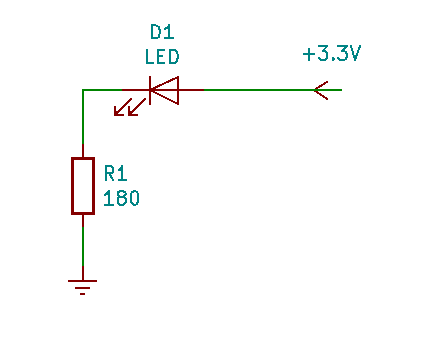
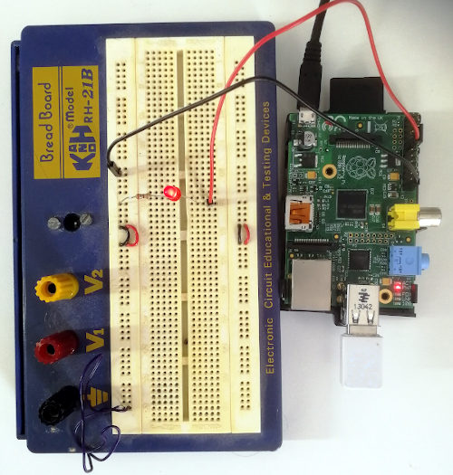

# Hi Pi!

I've got this old Raspberry PI 1b that I haven't used for ages, so I thought it was time to dust it of and get it up and running. I found this Hello world type of project on how to get a LED blinking that I followed. This is short description of what I did.

#Table of contents

- [Hi Pi!](#hi-pi)
  - [Equipment](#equipment)
  - [Installing Raspbian](#installing-raspbian)
  - [Setting up SSH](#setting-up-ssh)
  - [The blinking LED](#the-blinking-led)
    - [Connecting the components](#connecting-the-components)
    - [Code](#code)
    - [Getting code onto PI](#getting-code-onto-pi)
    - [Let there be a blinking light](#let-there-be-a-blinking-light)

## Equipment

For this project I had the following equipment

- A Raspberry PI 1b
- A 16GB SD card
- A Power supply
- A WiFi dongle
- HDMI cable
- Wireless keyboard and mouse
- A laptop with SD-card slot

For the blinking LED I also used

- A Bredboard
- A Red LED.
- A 270 Ohm resistor

The power supply I use is an old phone charger with 5V supply and 1A current. According to [raspberries documentation pages](https://www.raspberrypi.org/documentation/hardware/raspberrypi/power/README.md) the recommendation for my model is 5.1V and 1.2A. The same page mentions that if supply voltage drops below 4.63 (+/-5%) then this may cause corrupted data on your SD card. You might want to read the section about backpowering as well. The description I followed used a 180 Ohm resistor but the closest i had available was 270 ohms, which still worked for me. Before we start
building and coding lets install an os.

## Installing Raspbian

There are a number of different OS images available and you can find links to them at the official [Dowloads page](https://www.raspberrypi.org/downloads/). For this project I will keep it simple and the Raspberry Pi Imager. It's a simple GUI tool which downloads and installs the image of your choice onto your SD card by just a few clicks of the mouse button. This tool is also available on Ubuntu as a snap package if you prefer installing it using the software manager on Ubuntu. The PI uses SD-card for a disc, so we need a computer with an SD-card slot. Luckily I got one on my laptop. The imager GUI is pretty much self explanatory. Just choose an OS and the target SD card and click the button that says write, it could not be simpler. After the application finished I just moved the card to my PI, connected the HDMI between PI and screen, plugged my WiFi dongle into one of the two USB ports and my bluetooth wireless receiver for keyboard and mouse into the other USB. Finally I plugged in the power supply into the wall. To my amazement my PI booted up raspbian on my screen on the first attempt. At first boot you will be prompted for language, networking etc. In the final step you will be asked if you want to check for updates. The process of downloading updates seemed to get stuck at one point so decided to reboot skip the last step and just pull down updates using apt.

```sh
sudo apt update
sudo apt upgrade
```

Other than that everything worked great.

## Setting up SSH

I'm going to use my PI as a headless device (without screen, mouse or keyboard). To be able to access it and execute command and code on the device i will setup SSH on it. SSH seems to installed by default. In case it's not installed you can install it like so

```sh
sudo apt install openssh-server openssh-client
```

To see whether the service is running or not we can issue the following command

```sh
systemctl status ssh
```

Should the service not be running it can be started issuing

```sh
systemctl start ssh
```

Once you got the server up an running on your PI you can access it from outside using your ssh client. By default you can access it using password authentication.

```sh
ssh user@server
```

where user is pi by default and server is the ip your PI. The ip of the device your on can be found using `hostname -I`. Alternatively you can reach into your router and find the ip that way. Ok at this point you can log into PI using your PI password which you set at time of installation of OS. All well, we could stop at that but rather than using password authentication I will use public key schema instead. There is a couple of basic things you should know for this. First we need to generate a public/private key pair. The public key is a key you share with the parti you want to share a secret with. Your private keys you should "guard with your life", never ever show your private parts to strangers or even friends :-). The private key is for your eyes only and security of these protocols are based on only you having access to the private key. Anyway a key pair can be generated issuing the command on the computer we want to able to SSH into PI

```sh
ssh-keygen -f ~/.ssh/my-key-ecdsa -t ecdsa -b 521
```

This will generate two files in ~/.ssh/, he first is the private key called my-key-ecdsa and the second is the public key named my-key-ecdsa.pub. We use the -t parameter to choose the key-algorithm in this case I use ecdsa. The -b 521 just tells how many bits the algorithm shall use for keys. For more information on choosing algorithms i refer you to the [SSH pages](https://www.ssh.com/ssh/keygen/#sec-Choosing-an-Algorithm-and-Key-Size). Running this command you will be prompted for a passphrase. This passphrase is suppose to protect outsiders from getting access to keys. Every time you access key you will be prompted for the passphrase. This can become annoying so we can add the key to the ssh-agent. The ssh-agent manages identity keys and passphrases.

```sh
ssh-add my-key-ecdsa
```

For SSH server to be able to identify us we will need to hand it our public key. We could copy and append the private key to servers `.ssh/authorized_keys` by hand but SSH has a tool for this as well `ssh-copy-id`. For the following step we need set `PasswordAuthentication` inside `/etc/ssh/sshd_conf` to yes. This allows us to use, well password authentication. As you have already guessed this was already set by default (we logged in using password authentication before). Now to upload the key perform following command from the computer we want to use to communicate with the PI.

```sh
ssh-copy-id -i ~/.ssh/my-key {user}@{host}
```

which in my case looks something like

```sh
ssh-copy-id -i ~/.ssh/my-key-ecdsa pi@192.168.1.111
```

Now at this point you should be able to access your PI using keys. You might be prompted for passphrase to access those keys but you wont send password flying over network. The passphrase is of course the one you added when creating the keys. Finally we want to disallow using password authentication as we now have keys. So inside PI (which you now can reach via SSH whitout the password) edit the file `/etc/ssh/sshd_conf` you need to find the line saying `PasswordAuthentication no` and change the no to yes so the line should look like this

```sh
PasswordAuthentication yes
```

Save the file and restart the server in order for the change to take effect.

```sh
systemctl restart ssh
```

Now we no longer need to have PI plugged into screen mouse or keyboard.

## The blinking LED

The PI exposes a number General Purpose I/O pins on the board. Here we are going connect one of them to a LED and using a short snippet of python code make it blink. One easy way to get information about the pin configuration on your PI is to issue the command

### Connecting the components

A GPIO on the PI will output around 3.3V when high. This could be used to represent logical one for your digital circuits for instance. I will to this as V<sub>PIOUT</sub>. The LED I found has a forward voltage (V<sub>F</sub>) somewhere around 1.9V and it shouldn't be exposed to more than 20 mA current (I<sub>F</sub>) at max, if i understood the specs correctly.
In order to protect the the led from burning we need to add resistor in series with the LED. We can calculate the minimum resistance (R) for this resistor as

<p align="center">
  
</p>

With our specs we get 70 Ohm as lower bound. I only had 270 Ohm resistor which which is well over the lower bound. The more current you have running through the LED the brighter it will burn. But as mentioned above to much will break it. If you add two much resistance on the other hand it wont light up at all. The instructions i followed recommended 180 Ohm. Below you have super simple schematic of the situation we have going on.

<p align="center">
  
</p>

We want to connect the LED:s anode, the longer "leg" to a GPIO pin that will deliver 3.3V when running high and the LED:s cathode, that is the shorter leg to the resistor which is connected to a ground PIN on PI the. This is unless some ill willed person has cut the legs to fool you then you have to watch inside the bulb to identify the parts. We can find out the pin configuration of the board using the command.

```sh
pinout
```

this is what it outputs on my PI excluding some fancy colors.

```sh
P1:
   3V3  (1) (2)  5V
 GPIO2  (3) (4)  5V
 GPIO3  (5) (6)  GND
 GPIO4  (7) (8)  GPIO14
   GND  (9) (10) GPIO15
GPIO17 (11) (12) GPIO18
GPIO27 (13) (14) GND
GPIO22 (15) (16) GPIO23
   3V3 (17) (18) GPIO24
GPIO10 (19) (20) GND
 GPIO9 (21) (22) GPIO25
GPIO11 (23) (24) GPIO8
   GND (25) (26) GPIO7

P5:
    5V (1) (2) 3V3
GPIO28 (3) (4) GPIO29
GPIO30 (5) (6) GPIO31
   GND (7) (8) GND
```

The ones we are interested in are the ones at P1. You can find the marking P1 on your board as well. So I'm going to use GPIO17 located at pin 11 and GND(ground) at pin 25. Why these two you ask? For no particular reason. I could have chosen some other GPIO GND combo it would have made any major
difference as long your code matches your choice.

### Code

Finally the code you need to trigger the GPIO. Just throw in fill with
the suffix .py i named it hipi.py.

```python
import RPi.GPIO as GPIO
import time

# Remeber We picked GPIO17
RED_LED_PIN = 17

# We want to use something called Broadcom SOC chanel designation
# This allows us GPIO numbers rather than physical pin numbers
# GPIO.setmode(GPIO.BOARD) uses physical pin numbering.
GPIO.setmode(GPIO.BCM)
# set red pin led to be used as output
GPIO.setup(RED_LED_PIN, GPIO.OUT)

while True:
    #Set output high logicall one
    GPIO.output(RED_LED_PIN, GPIO.HIGH)
    #wait a sec
    time.sleep(1)
    # Set output high logical zero
    GPIO.output(RED_LED_PIN, GPIO.LOW)
    #wait a sec
    time.sleep(1)
```

GPIO module comes preinstalled on raspbian but if you want it locally on some other machine it's available through pip.

```sh
pip install RPi.GPIO
```

### Getting code onto PI

There are several ways of getting code onto you PI one way is to use scp.The syntax looks like this

```sh
scp sourcefile user@server:pathToTargetFile
```

So in my case I could do something like

```sh
scp hipi.py pi@192.168.1.111:/home/pi/code/hipi.py
```

Alternatively You can of course clone your code repository from for instance github and get your code onto your device that way.

### Let there be a blinking light

The last step is to run the code. If you got every thing hooked up just SSH into your PI

```sh
ssh pi@192.168.1.111
```

Locate your code and run it using python interpreter.

```sh
cd code
python3 hipi.py
```

And here we go...

<p align="center">
  
</p>
